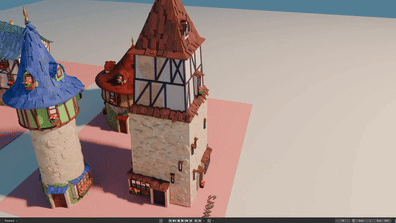

Procedural French Style Architecture in Geometry nodes Blender 5.0
=================
This repo contains nodes for a procedural mesh generation of french style architecture. It was written and tested on Blender 5.0. The test machine has a 5090 graphic card, alot of ram and a powerful CPU, so the performance on lower end PCs could be very different compared to the videos.

The nodes are well documented and cleaned up, with viewer nodes in betweens to be able to follow whats happening. At a later date I will release a blog post explaining some of the tricks more in depth.

Here is an example of the baisic houses. You can define the foundation of the house in edit mode. Just make sure you dont apply your tranform if you wanto rotate, scale the house, do it on the object. I am assuming the house is somewhat centered around X axis.

Here is an example of the towers. They are purely GN defined, so their controls is on the modifier. There are two type, the round one and the square one. 

You can also generate rails, terraces and stairs. You have to kind of mix and match those nodes based on your needs.

--------------------------

Roadmap:
Add two different type of towers, bridges, roads and ground.